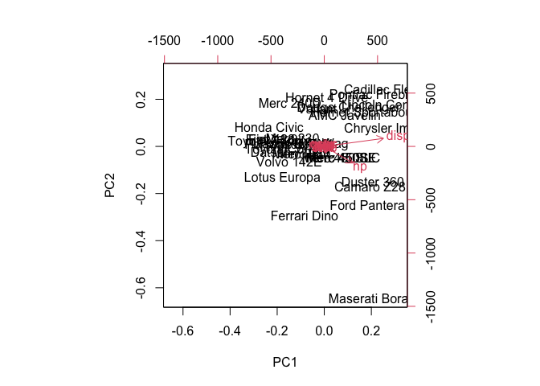
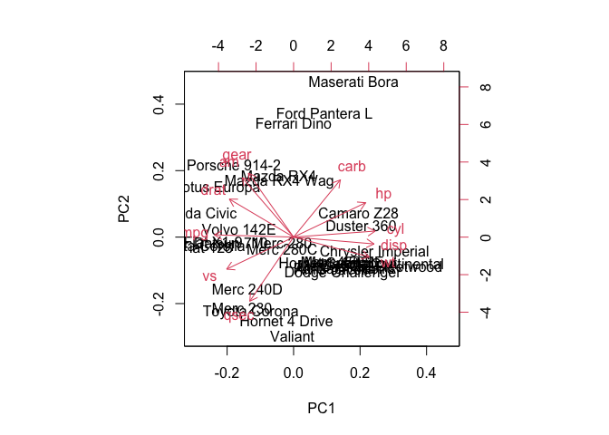

# Class 08: PCA Mini Project
Vanesa Fernandez

Side

``` r
head(mtcars)
```

                       mpg cyl disp  hp drat    wt  qsec vs am gear carb
    Mazda RX4         21.0   6  160 110 3.90 2.620 16.46  0  1    4    4
    Mazda RX4 Wag     21.0   6  160 110 3.90 2.875 17.02  0  1    4    4
    Datsun 710        22.8   4  108  93 3.85 2.320 18.61  1  1    4    1
    Hornet 4 Drive    21.4   6  258 110 3.08 3.215 19.44  1  0    3    1
    Hornet Sportabout 18.7   8  360 175 3.15 3.440 17.02  0  0    3    2
    Valiant           18.1   6  225 105 2.76 3.460 20.22  1  0    3    1

Let’s look at the mean value of every column:

``` r
apply(mtcars, 2, mean)
```

           mpg        cyl       disp         hp       drat         wt       qsec 
     20.090625   6.187500 230.721875 146.687500   3.596563   3.217250  17.848750 
            vs         am       gear       carb 
      0.437500   0.406250   3.687500   2.812500 

Let’s look at “spread” via `sd()`

``` r
apply(mtcars, 2, sd)
```

            mpg         cyl        disp          hp        drat          wt 
      6.0269481   1.7859216 123.9386938  68.5628685   0.5346787   0.9784574 
           qsec          vs          am        gear        carb 
      1.7869432   0.5040161   0.4989909   0.7378041   1.6152000 

``` r
apply(mtcars, 1, mean)
```

              Mazda RX4       Mazda RX4 Wag          Datsun 710      Hornet 4 Drive 
               29.90727            29.98136            23.59818            38.73955 
      Hornet Sportabout             Valiant          Duster 360           Merc 240D 
               53.66455            35.04909            59.72000            24.63455 
               Merc 230            Merc 280           Merc 280C          Merc 450SE 
               27.23364            31.86000            31.78727            46.43091 
             Merc 450SL         Merc 450SLC  Cadillac Fleetwood Lincoln Continental 
               46.50000            46.35000            66.23273            66.05855 
      Chrysler Imperial            Fiat 128         Honda Civic      Toyota Corolla 
               65.97227            19.44091            17.74227            18.81409 
          Toyota Corona    Dodge Challenger         AMC Javelin          Camaro Z28 
               24.88864            47.24091            46.00773            58.75273 
       Pontiac Firebird           Fiat X1-9       Porsche 914-2        Lotus Europa 
               57.37955            18.92864            24.77909            24.88027 
         Ford Pantera L        Ferrari Dino       Maserati Bora          Volvo 142E 
               60.97182            34.50818            63.15545            26.26273 

``` r
pca <- prcomp(mtcars)
biplot (pca)
```



Let’s try scalling the data”

``` r
mtscale <- scale(mtcars)
head(mtscale)
```

                             mpg        cyl        disp         hp       drat
    Mazda RX4          0.1508848 -0.1049878 -0.57061982 -0.5350928  0.5675137
    Mazda RX4 Wag      0.1508848 -0.1049878 -0.57061982 -0.5350928  0.5675137
    Datsun 710         0.4495434 -1.2248578 -0.99018209 -0.7830405  0.4739996
    Hornet 4 Drive     0.2172534 -0.1049878  0.22009369 -0.5350928 -0.9661175
    Hornet Sportabout -0.2307345  1.0148821  1.04308123  0.4129422 -0.8351978
    Valiant           -0.3302874 -0.1049878 -0.04616698 -0.6080186 -1.5646078
                                wt       qsec         vs         am       gear
    Mazda RX4         -0.610399567 -0.7771651 -0.8680278  1.1899014  0.4235542
    Mazda RX4 Wag     -0.349785269 -0.4637808 -0.8680278  1.1899014  0.4235542
    Datsun 710        -0.917004624  0.4260068  1.1160357  1.1899014  0.4235542
    Hornet 4 Drive    -0.002299538  0.8904872  1.1160357 -0.8141431 -0.9318192
    Hornet Sportabout  0.227654255 -0.4637808 -0.8680278 -0.8141431 -0.9318192
    Valiant            0.248094592  1.3269868  1.1160357 -0.8141431 -0.9318192
                            carb
    Mazda RX4          0.7352031
    Mazda RX4 Wag      0.7352031
    Datsun 710        -1.1221521
    Hornet 4 Drive    -1.1221521
    Hornet Sportabout -0.5030337
    Valiant           -1.1221521

What is the mean of each “dimension”/column

``` r
round(apply(mtscale, 2, mean), 3)
```

     mpg  cyl disp   hp drat   wt qsec   vs   am gear carb 
       0    0    0    0    0    0    0    0    0    0    0 

``` r
round(apply(mtscale, 2, sd), 3)
```

     mpg  cyl disp   hp drat   wt qsec   vs   am gear carb 
       1    1    1    1    1    1    1    1    1    1    1 

Let’s plot `mpg` vs `disp` for both mtcars and after the scalled data in
`mtscale`

``` r
library(ggplot2)

ggplot(mtcars) + 
  aes(mpg,disp) +
  geom_point()
```


``` r
library(ggplot2)

ggplot(mtscale) + 
  aes(mpg,disp) +
  geom_point()
```


``` r
pca2 <- prcomp(mtscale)
biplot (pca2)
```



## Breast Cancer FNA data
