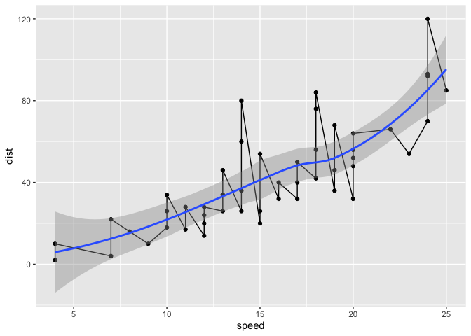
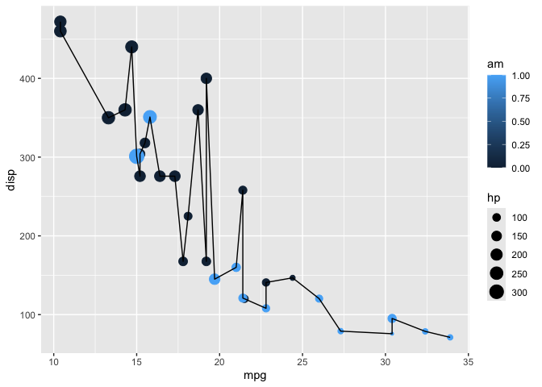
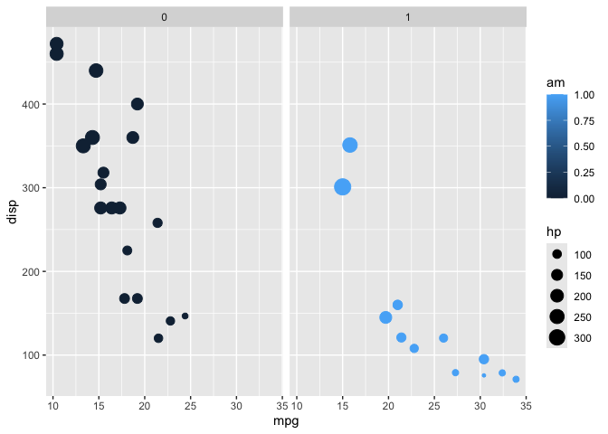
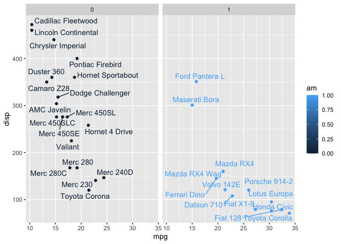
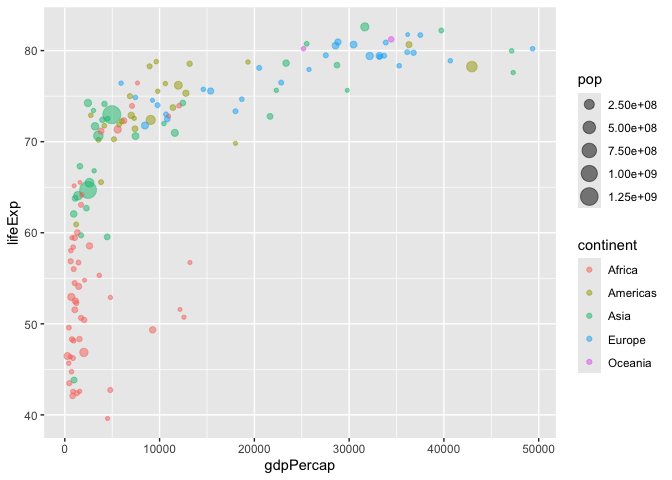
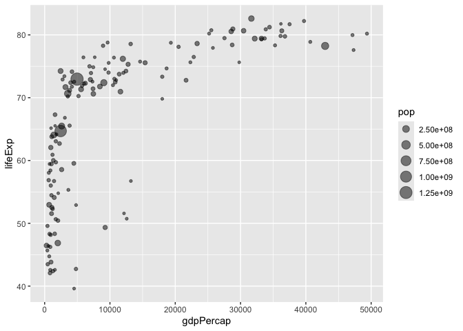
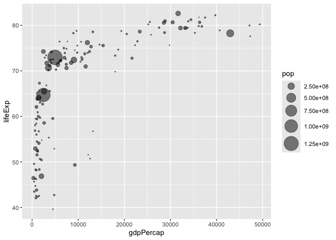
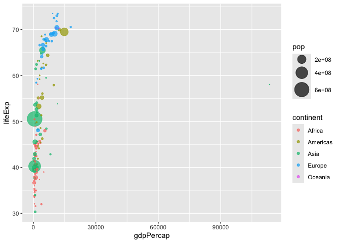
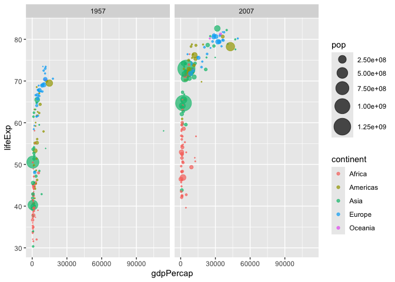
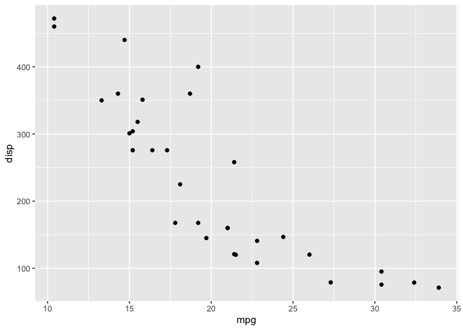

# Class 05: Data Viz witth ggplot
Vanesa Fernandez

R has lot’s of ways to make figures and graphs in particular. One that
comes with R out of the box is called **“base” R** - the ‘plot()’
function

``` r
plot(cars)
```


A very popular package in this area is called \*ggplot2\*\*

Before I can use any ad-on like this I must install it whit the
`install.packages("ggplot2")` command/function

Then to use the package I need to load it with a `library(ggplot2)`)
call

``` r
library(ggplot2)
ggplot(cars) + 
  aes(x=speed, y=dist) + 
  geom_point()
```


For “simple” plots like this one base R code will be much shorter than
ggplot code.

Let’s fit a model and show it on my plot:

``` r
ggplot(cars) + 
  aes(x=speed, y=dist) + 
  geom_point() + 
  geom_line() +
  geom_smooth()
```

    `geom_smooth()` using method = 'loess' and formula = 'y ~ x'



Every ggplot has at least 3 layers

1st- **data** (data.frame with the numbers or stuff you want a plot)
2nd- **aes**thetics (mapping of your columns to your plot: position,
size, line type/width, color, shape) 3rd- **geoms** (lots of these,
these are `geompoint()`, `geom_line()`, `geom_col()`)

``` r
head(mtcars)
```

                       mpg cyl disp  hp drat    wt  qsec vs am gear carb
    Mazda RX4         21.0   6  160 110 3.90 2.620 16.46  0  1    4    4
    Mazda RX4 Wag     21.0   6  160 110 3.90 2.875 17.02  0  1    4    4
    Datsun 710        22.8   4  108  93 3.85 2.320 18.61  1  1    4    1
    Hornet 4 Drive    21.4   6  258 110 3.08 3.215 19.44  1  0    3    1
    Hornet Sportabout 18.7   8  360 175 3.15 3.440 17.02  0  0    3    2
    Valiant           18.1   6  225 105 2.76 3.460 20.22  1  0    3    1

Make the ggplot of the `mtcars` data set using `mpg` vs `disp` and set
the size of the points to the `hp`. and set the color to `am`

``` r
ggplot(mtcars) + 
  aes(x=mpg, y=disp) + 
  geom_point(aes(size=hp, col=am)) +
  geom_line()
```



Now color all pts

``` r
ggplot(mtcars) + 
  aes(x=mpg, y=disp, size=hp, col=am) + 
  geom_point() +
  facet_wrap(~am)
```



``` r
library(ggrepel)

ggplot(mtcars) + 
  aes(x=mpg, y=disp, col=am, label=rownames(mtcars)) +
  geom_point() +
  facet_wrap(~am) +
  geom_text_repel()
```



Going Further exercises

``` r
library(gapminder)
```

``` r
library(dplyr)
```


    Attaching package: 'dplyr'

    The following objects are masked from 'package:stats':

        filter, lag

    The following objects are masked from 'package:base':

        intersect, setdiff, setequal, union

``` r
gapminder_2007 <- gapminder %>% filter(year==2007)
```

``` r
ggplot(gapminder_2007) +
  aes(x=gdpPercap, y=lifeExp) +
  geom_point(alpha=0.5)
```


Adding more variables to `aes()`

``` r
ggplot(gapminder_2007) +
  aes(x=gdpPercap, y=lifeExp, color=continent, size=pop) +
  geom_point(alpha=0.5)
```



Color the points by the numeric variable population pop

``` r
ggplot(gapminder_2007) + 
  aes(x = gdpPercap, y = lifeExp, color = pop) +
  geom_point(alpha=0.8)
```


Adjusting Point size

``` r
ggplot(gapminder_2007) + 
  aes(x = gdpPercap, y = lifeExp, size = pop) +
  geom_point(alpha=0.5)
```



Scaling information

``` r
ggplot(gapminder_2007) + 
  geom_point(aes(x = gdpPercap, y = lifeExp,
                 size = pop), alpha=0.5) + 
  scale_size_area(max_size = 10)
```



1957 plot

``` r
gapminder_1957 <- gapminder %>% filter(year==1957)

ggplot(gapminder_1957) + 
  aes(x = gdpPercap, y = lifeExp, color=continent,
                 size = pop) +
  geom_point(alpha=0.7) + 
  scale_size_area(max_size = 10) 
```



1957 and 2007 `facet_wrap()` plot

``` r
gapminder_1957 <- gapminder %>% filter(year==1957 | year==2007)

ggplot(gapminder_1957) + 
  geom_point(aes(x = gdpPercap, y = lifeExp, color=continent,
                 size = pop), alpha=0.7) + 
  scale_size_area(max_size = 10) +
  facet_wrap(~year)
```



Gene expression

``` r
url <- "https://bioboot.github.io/bimm143_S20/class-material/up_down_expression.txt"
genes <- read.delim(url)
head(genes)
```

            Gene Condition1 Condition2      State
    1      A4GNT -3.6808610 -3.4401355 unchanging
    2       AAAS  4.5479580  4.3864126 unchanging
    3      AASDH  3.7190695  3.4787276 unchanging
    4       AATF  5.0784720  5.0151916 unchanging
    5       AATK  0.4711421  0.5598642 unchanging
    6 AB015752.4 -3.6808610 -3.5921390 unchanging

``` r
nrow(genes)
```

    [1] 5196

There are 5196 genes in this dataset.

``` r
unique(genes$State)
```

    [1] "unchanging" "up"         "down"      

The `table()` function is very useful to tell me how many entries of
each type there are.

``` r
table(genes$State) / nrow(genes)
```


          down unchanging         up 
    0.01385681 0.96170131 0.02444188 

The functions `nrow()`, `ncol()`, and `table()` are ones I want you to
know.

> KEY POINTS Saving plots with **ggsave** Different plot “types” with
> different `geoms_**()` Faceting with `facet_wrap()` Multi-plot layout
> with the **patchwork** package

``` r
#install.packages("patchwork")
library(patchwork)
```

``` r
ggplot(mtcars) +
  aes(mpg, disp) +
  geom_point()
```



``` r
ggsave("myplot.pdf")
```

    Saving 7 x 5 in image
