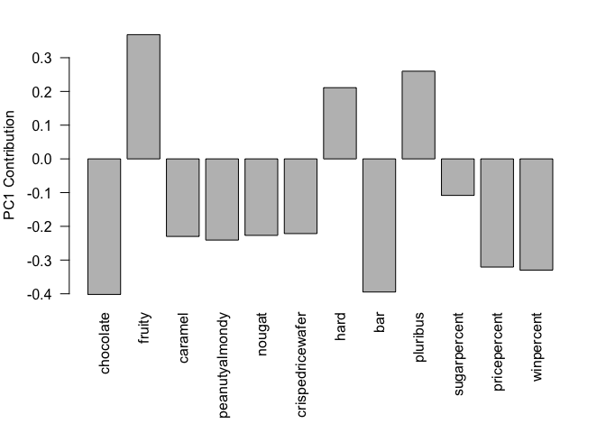

# Class 09 Halloween Mini-Project
Vanesa Fernandez A59026769

``` r
candy_file <- "https://raw.githubusercontent.com/fivethirtyeight/data/master/candy-power-ranking/candy-data.csv"

candy = read.csv(candy_file, row.names=1)
head(candy)
```

                 chocolate fruity caramel peanutyalmondy nougat crispedricewafer
    100 Grand            1      0       1              0      0                1
    3 Musketeers         1      0       0              0      1                0
    One dime             0      0       0              0      0                0
    One quarter          0      0       0              0      0                0
    Air Heads            0      1       0              0      0                0
    Almond Joy           1      0       0              1      0                0
                 hard bar pluribus sugarpercent pricepercent winpercent
    100 Grand       0   1        0        0.732        0.860   66.97173
    3 Musketeers    0   1        0        0.604        0.511   67.60294
    One dime        0   0        0        0.011        0.116   32.26109
    One quarter     0   0        0        0.011        0.511   46.11650
    Air Heads       0   0        0        0.906        0.511   52.34146
    Almond Joy      0   1        0        0.465        0.767   50.34755

> Q1. How many different candy types are in this dataset?

``` r
nrow(candy)
```

    [1] 85

> Q2. How many fruity candy types are in the dataset?

``` r
sum(candy$fruity)
```

    [1] 38

> Q3. What is your favorate candy?, what is it’s `winpercent` value?

``` r
candy["Milky Way", ]$winpercent
```

    [1] 73.09956

``` r
candy["charleston chew",]
```

       chocolate fruity caramel peanutyalmondy nougat crispedricewafer hard bar
    NA        NA     NA      NA             NA     NA               NA   NA  NA
       pluribus sugarpercent pricepercent winpercent
    NA       NA           NA           NA         NA

``` r
candy["Charleston Chew",]$winpercent
```

    [1] 38.97504

``` r
candy["Dums Dums",]$winpercent
```

    [1] NA

``` r
library(dplyr)
```


    Attaching package: 'dplyr'

    The following objects are masked from 'package:stats':

        filter, lag

    The following objects are masked from 'package:base':

        intersect, setdiff, setequal, union

``` r
candy |>
  filter(rownames(candy) %in% c("Dums Dums", "Twix")) |>
  select(winpercent)
```

         winpercent
    Twix   81.64291

> Q4. What is the winpercent value for “Kit Kat”? Q5. What is the
> winpercent value for “Tootsie Roll Snack Bars”?

``` r
candy |>
  filter(rownames(candy) %in% c("Kit Kat",
                                "Tootsie Roll Snack Bars")) |>
  select(winpercent)
```

                            winpercent
    Kit Kat                    76.7686
    Tootsie Roll Snack Bars    49.6535

The `%in%` operator is useful for checking the intersection of two
vectors.

``` r
c("barry", "liz", "chandra") %in% c("paul", 
                                   "alice", "liz")
```

    [1] FALSE  TRUE FALSE

``` r
candy |>
  filter (winpercent >75) |>
  filter(pricepercent < 0.5)
```

                       chocolate fruity caramel peanutyalmondy nougat
    Reese's Miniatures         1      0       0              1      0
                       crispedricewafer hard bar pluribus sugarpercent pricepercent
    Reese's Miniatures                0    0   0        0        0.034        0.279
                       winpercent
    Reese's Miniatures   81.86626

``` r
##install.packages("skimr")
library("skimr")
skim(candy)
```

|                                                  |       |
|:-------------------------------------------------|:------|
| Name                                             | candy |
| Number of rows                                   | 85    |
| Number of columns                                | 12    |
| \_\_\_\_\_\_\_\_\_\_\_\_\_\_\_\_\_\_\_\_\_\_\_   |       |
| Column type frequency:                           |       |
| numeric                                          | 12    |
| \_\_\_\_\_\_\_\_\_\_\_\_\_\_\_\_\_\_\_\_\_\_\_\_ |       |
| Group variables                                  | None  |

Data summary

**Variable type: numeric**

| skim_variable | n_missing | complete_rate | mean | sd | p0 | p25 | p50 | p75 | p100 | hist |
|:---|---:|---:|---:|---:|---:|---:|---:|---:|---:|:---|
| chocolate | 0 | 1 | 0.44 | 0.50 | 0.00 | 0.00 | 0.00 | 1.00 | 1.00 | ▇▁▁▁▆ |
| fruity | 0 | 1 | 0.45 | 0.50 | 0.00 | 0.00 | 0.00 | 1.00 | 1.00 | ▇▁▁▁▆ |
| caramel | 0 | 1 | 0.16 | 0.37 | 0.00 | 0.00 | 0.00 | 0.00 | 1.00 | ▇▁▁▁▂ |
| peanutyalmondy | 0 | 1 | 0.16 | 0.37 | 0.00 | 0.00 | 0.00 | 0.00 | 1.00 | ▇▁▁▁▂ |
| nougat | 0 | 1 | 0.08 | 0.28 | 0.00 | 0.00 | 0.00 | 0.00 | 1.00 | ▇▁▁▁▁ |
| crispedricewafer | 0 | 1 | 0.08 | 0.28 | 0.00 | 0.00 | 0.00 | 0.00 | 1.00 | ▇▁▁▁▁ |
| hard | 0 | 1 | 0.18 | 0.38 | 0.00 | 0.00 | 0.00 | 0.00 | 1.00 | ▇▁▁▁▂ |
| bar | 0 | 1 | 0.25 | 0.43 | 0.00 | 0.00 | 0.00 | 0.00 | 1.00 | ▇▁▁▁▂ |
| pluribus | 0 | 1 | 0.52 | 0.50 | 0.00 | 0.00 | 1.00 | 1.00 | 1.00 | ▇▁▁▁▇ |
| sugarpercent | 0 | 1 | 0.48 | 0.28 | 0.01 | 0.22 | 0.47 | 0.73 | 0.99 | ▇▇▇▇▆ |
| pricepercent | 0 | 1 | 0.47 | 0.29 | 0.01 | 0.26 | 0.47 | 0.65 | 0.98 | ▇▇▇▇▆ |
| winpercent | 0 | 1 | 50.32 | 14.71 | 22.45 | 39.14 | 47.83 | 59.86 | 84.18 | ▃▇▆▅▂ |

> Q6. Is there any variable/column that looks to be on a different scale
> to the majority of the other columns in the dataset? Q7. What do you
> think a zero and one represent for the candy\$chocolate column? Q8.
> Plot a histogram of winpercent values

We can do this a few different ways: with base R `hist()` or with
`ggplot()`. Let’s try both…

``` r
hist(candy$winpercent, breaks=10)
```


> Q9. Is the distribution of winpercent values symmetrical?

``` r
library (ggplot2)

ggplot(candy) +
  aes(winpercent) +
  geom_histogram(bins=10) +
  theme_bw()
```


> Q10. Is the center of the distribution above or below 50%? below

``` r
summary(candy$winpercent)
```

       Min. 1st Qu.  Median    Mean 3rd Qu.    Max. 
      22.45   39.14   47.83   50.32   59.86   84.18 

> Q11. On average is chocolate candy higher or lower ranked than fruit
> candy?

``` r
inds <- as.logical(candy$chocolate)
candy [inds,]$winpercent
```

     [1] 66.97173 67.60294 50.34755 56.91455 38.97504 55.37545 62.28448 56.49050
     [9] 59.23612 57.21925 76.76860 71.46505 66.57458 55.06407 73.09956 60.80070
    [17] 64.35334 47.82975 54.52645 70.73564 66.47068 69.48379 81.86626 84.18029
    [25] 73.43499 72.88790 65.71629 34.72200 37.88719 76.67378 59.52925 48.98265
    [33] 43.06890 45.73675 49.65350 81.64291 49.52411

``` r
inds <- candy$chocolate == 1
candy[inds,]$winpercent
```

     [1] 66.97173 67.60294 50.34755 56.91455 38.97504 55.37545 62.28448 56.49050
     [9] 59.23612 57.21925 76.76860 71.46505 66.57458 55.06407 73.09956 60.80070
    [17] 64.35334 47.82975 54.52645 70.73564 66.47068 69.48379 81.86626 84.18029
    [25] 73.43499 72.88790 65.71629 34.72200 37.88719 76.67378 59.52925 48.98265
    [33] 43.06890 45.73675 49.65350 81.64291 49.52411

## alternatively :

``` r
candy |>
  filter(chocolate == 1) |>
  select(winpercent)
```

                                winpercent
    100 Grand                     66.97173
    3 Musketeers                  67.60294
    Almond Joy                    50.34755
    Baby Ruth                     56.91455
    Charleston Chew               38.97504
    Hershey's Kisses              55.37545
    Hershey's Krackel             62.28448
    Hershey's Milk Chocolate      56.49050
    Hershey's Special Dark        59.23612
    Junior Mints                  57.21925
    Kit Kat                       76.76860
    Peanut butter M&M's           71.46505
    M&M's                         66.57458
    Milk Duds                     55.06407
    Milky Way                     73.09956
    Milky Way Midnight            60.80070
    Milky Way Simply Caramel      64.35334
    Mounds                        47.82975
    Mr Good Bar                   54.52645
    Nestle Butterfinger           70.73564
    Nestle Crunch                 66.47068
    Peanut M&Ms                   69.48379
    Reese's Miniatures            81.86626
    Reese's Peanut Butter cup     84.18029
    Reese's pieces                73.43499
    Reese's stuffed with pieces   72.88790
    Rolo                          65.71629
    Sixlets                       34.72200
    Nestle Smarties               37.88719
    Snickers                      76.67378
    Snickers Crisper              59.52925
    Tootsie Pop                   48.98265
    Tootsie Roll Juniors          43.06890
    Tootsie Roll Midgies          45.73675
    Tootsie Roll Snack Bars       49.65350
    Twix                          81.64291
    Whoppers                      49.52411

``` r
inds <- candy$chocolate == 1
choc.win <- candy[inds,]$winpercent

inds <- candy$fruity == 1
fruit.win <- candy[inds,]$winpercent
```

Then I could compare these

``` r
summary(fruit.win)
```

       Min. 1st Qu.  Median    Mean 3rd Qu.    Max. 
      22.45   39.04   42.97   44.12   52.11   67.04 

``` r
summary(choc.win)
```

       Min. 1st Qu.  Median    Mean 3rd Qu.    Max. 
      34.72   50.35   60.80   60.92   70.74   84.18 

``` r
t.test(fruit.win, choc.win)
```


        Welch Two Sample t-test

    data:  fruit.win and choc.win
    t = -6.2582, df = 68.882, p-value = 2.871e-08
    alternative hypothesis: true difference in means is not equal to 0
    95 percent confidence interval:
     -22.15795 -11.44563
    sample estimates:
    mean of x mean of y 
     44.11974  60.92153 

> Q13. What are the five least liked candy types in this set?

There are two related function that are useful here `sort()` and
`order()`

``` r
play <- c(2,1, 5,3)
sort(play)
```

    [1] 1 2 3 5

``` r
order(play) ## I dont understand this part
```

    [1] 2 1 4 3

``` r
play [order(play)]
```

    [1] 1 2 3 5

``` r
l <- c("c", "a", "b")
sort(l)
```

    [1] "a" "b" "c"

``` r
order(l)
```

    [1] 2 3 1

``` r
n <- c("d", "a")
n[order(n)]
```

    [1] "a" "d"

``` r
inds <- order(candy$winpercent)
head(candy[inds,])
```

                       chocolate fruity caramel peanutyalmondy nougat
    Nik L Nip                  0      1       0              0      0
    Boston Baked Beans         0      0       0              1      0
    Chiclets                   0      1       0              0      0
    Super Bubble               0      1       0              0      0
    Jawbusters                 0      1       0              0      0
    Root Beer Barrels          0      0       0              0      0
                       crispedricewafer hard bar pluribus sugarpercent pricepercent
    Nik L Nip                         0    0   0        1        0.197        0.976
    Boston Baked Beans                0    0   0        1        0.313        0.511
    Chiclets                          0    0   0        1        0.046        0.325
    Super Bubble                      0    0   0        0        0.162        0.116
    Jawbusters                        0    1   0        1        0.093        0.511
    Root Beer Barrels                 0    1   0        1        0.732        0.069
                       winpercent
    Nik L Nip            22.44534
    Boston Baked Beans   23.41782
    Chiclets             24.52499
    Super Bubble         27.30386
    Jawbusters           28.12744
    Root Beer Barrels    29.70369

``` r
head(candy[order(candy$winpercent),], n=5)
```

                       chocolate fruity caramel peanutyalmondy nougat
    Nik L Nip                  0      1       0              0      0
    Boston Baked Beans         0      0       0              1      0
    Chiclets                   0      1       0              0      0
    Super Bubble               0      1       0              0      0
    Jawbusters                 0      1       0              0      0
                       crispedricewafer hard bar pluribus sugarpercent pricepercent
    Nik L Nip                         0    0   0        1        0.197        0.976
    Boston Baked Beans                0    0   0        1        0.313        0.511
    Chiclets                          0    0   0        1        0.046        0.325
    Super Bubble                      0    0   0        0        0.162        0.116
    Jawbusters                        0    1   0        1        0.093        0.511
                       winpercent
    Nik L Nip            22.44534
    Boston Baked Beans   23.41782
    Chiclets             24.52499
    Super Bubble         27.30386
    Jawbusters           28.12744

OR:

``` r
candy %>% arrange(winpercent) %>% head(5)
```

                       chocolate fruity caramel peanutyalmondy nougat
    Nik L Nip                  0      1       0              0      0
    Boston Baked Beans         0      0       0              1      0
    Chiclets                   0      1       0              0      0
    Super Bubble               0      1       0              0      0
    Jawbusters                 0      1       0              0      0
                       crispedricewafer hard bar pluribus sugarpercent pricepercent
    Nik L Nip                         0    0   0        1        0.197        0.976
    Boston Baked Beans                0    0   0        1        0.313        0.511
    Chiclets                          0    0   0        1        0.046        0.325
    Super Bubble                      0    0   0        0        0.162        0.116
    Jawbusters                        0    1   0        1        0.093        0.511
                       winpercent
    Nik L Nip            22.44534
    Boston Baked Beans   23.41782
    Chiclets             24.52499
    Super Bubble         27.30386
    Jawbusters           28.12744

Which approach do you prefer and why?
`candy %>% arrange(winpercent) %>% head(5)` because It’s easier to
remember and shorter

> Q14. What are the top 5 all time favorite candy types out of this set?

``` r
inds <- order(candy$winpercent, decreasing = T)
head(candy[inds,], 5)
```

                              chocolate fruity caramel peanutyalmondy nougat
    Reese's Peanut Butter cup         1      0       0              1      0
    Reese's Miniatures                1      0       0              1      0
    Twix                              1      0       1              0      0
    Kit Kat                           1      0       0              0      0
    Snickers                          1      0       1              1      1
                              crispedricewafer hard bar pluribus sugarpercent
    Reese's Peanut Butter cup                0    0   0        0        0.720
    Reese's Miniatures                       0    0   0        0        0.034
    Twix                                     1    0   1        0        0.546
    Kit Kat                                  1    0   1        0        0.313
    Snickers                                 0    0   1        0        0.546
                              pricepercent winpercent
    Reese's Peanut Butter cup        0.651   84.18029
    Reese's Miniatures               0.279   81.86626
    Twix                             0.906   81.64291
    Kit Kat                          0.511   76.76860
    Snickers                         0.651   76.67378

``` r
ggplot(candy) +
  aes(y=rownames(candy), x= winpercent) +
  geom_col()
```


> Q15. Make a first barplot of candy ranking based on winpercent values

``` r
ggplot(candy) +
  aes(x= winpercent, y=rownames(candy)) +
  geom_col()
```


``` r
ggplot(candy) +
  aes(winpercent, rownames(candy)) +
  geom_col()
```


> Q16. This is quite ugly, use the reorder() function to get the bars
> sorted by winpercent?

``` r
ggplot(candy) +
  aes(x=winpercent, y=reorder(rownames(candy), winpercent)) +
  geom_col()
```


``` r
ggplot(candy) +
  aes(x=winpercent, y=reorder(rownames(candy), winpercent), fill=chocolate) +
  geom_col()
```


I want to define my own colors I am start with a place-holder vector of
colors all “black”

``` r
mycols <- rep("black", nrow(candy))
mycols [as.logical(candy$chocolate)] <- "chocolate"
mycols [as.logical(candy$bar)] <- "brown"
mycols [as.logical(candy$fruity)] <- "pink"

##Favorite candy and color:
mycols[rownames(candy) == "Milky Way"] <- "yellow"

mycols
```

     [1] "brown"     "brown"     "black"     "black"     "pink"      "brown"    
     [7] "brown"     "black"     "black"     "pink"      "brown"     "pink"     
    [13] "pink"      "pink"      "pink"      "pink"      "pink"      "pink"     
    [19] "pink"      "black"     "pink"      "pink"      "chocolate" "brown"    
    [25] "brown"     "brown"     "pink"      "chocolate" "brown"     "pink"     
    [31] "pink"      "pink"      "chocolate" "chocolate" "pink"      "chocolate"
    [37] "yellow"    "brown"     "brown"     "brown"     "brown"     "pink"     
    [43] "brown"     "brown"     "pink"      "pink"      "brown"     "chocolate"
    [49] "black"     "pink"      "pink"      "chocolate" "chocolate" "chocolate"
    [55] "chocolate" "pink"      "chocolate" "black"     "pink"      "chocolate"
    [61] "pink"      "pink"      "chocolate" "pink"      "brown"     "brown"    
    [67] "pink"      "pink"      "pink"      "pink"      "black"     "black"    
    [73] "pink"      "pink"      "pink"      "chocolate" "chocolate" "brown"    
    [79] "pink"      "brown"     "pink"      "pink"      "pink"      "black"    
    [85] "chocolate"

> Q. Color your favorite candy with your favorite color

``` r
ggplot(candy) +
  aes(x=winpercent, y=reorder(rownames(candy), winpercent)) +
  geom_col(fill=mycols)
```


> Q17. What is the worst ranked chocolate candy? Sixlets Q18. What is
> the best ranked fruity candy? Starburst

Plot winpercent vs pricepercent

``` r
ggplot(candy) +
  aes(winpercent, pricepercent, label=rownames(candy)) +
  geom_point(col=mycols) +
  geom_text(col=mycols)
```


``` r
##install.packages(ggrepel)

library(ggrepel)
ggplot(candy) +
  aes(winpercent, pricepercent, label=rownames(candy)) +
  geom_point(col=mycols) +
  geom_text_repel(col=mycols)
```

    Warning: ggrepel: 29 unlabeled data points (too many overlaps). Consider
    increasing max.overlaps


> Q22. Examining this plot what two variables are anti-correlated
> (i.e. have minus values)? A: chocolate and fruty

> Q23. Similarly, what two variables are most positively correlated? A:
> bar and chocolate

## Exploring the correlation structure

``` r
cij <- cor(candy)
##install.packages("corrplot")
library(corrplot)
```

    corrplot 0.95 loaded

``` r
corrplot (cij)
```


## Principal Component Analysis

``` r
pca <- prcomp(candy, scale=TRUE)
summary(pca)
```

    Importance of components:
                              PC1    PC2    PC3     PC4    PC5     PC6     PC7
    Standard deviation     2.0788 1.1378 1.1092 1.07533 0.9518 0.81923 0.81530
    Proportion of Variance 0.3601 0.1079 0.1025 0.09636 0.0755 0.05593 0.05539
    Cumulative Proportion  0.3601 0.4680 0.5705 0.66688 0.7424 0.79830 0.85369
                               PC8     PC9    PC10    PC11    PC12
    Standard deviation     0.74530 0.67824 0.62349 0.43974 0.39760
    Proportion of Variance 0.04629 0.03833 0.03239 0.01611 0.01317
    Cumulative Proportion  0.89998 0.93832 0.97071 0.98683 1.00000

``` r
plot(pca$x[,1], pca$x[,2], col=mycols, pch=16)
```


``` r
pca$rotation[,1]
```

           chocolate           fruity          caramel   peanutyalmondy 
          -0.4019466        0.3683883       -0.2299709       -0.2407155 
              nougat crispedricewafer             hard              bar 
          -0.2268102       -0.2215182        0.2111587       -0.3947433 
            pluribus     sugarpercent     pricepercent       winpercent 
           0.2600041       -0.1083088       -0.3207361       -0.3298035 

``` r
par(mar=c(8,4,2,2))
barplot(pca$rotation[,1], las=2, ylab="PC1 Contribution")
```



``` r
# Make a new data-frame with our PCA results and candy data
my_data <- cbind(candy, pca$x[,1:3])
```

``` r
p <- ggplot(my_data) + 
        aes(x=PC1, y=PC2, 
            size=winpercent/100,  
            text=rownames(my_data),
            label=rownames(my_data)) +
        geom_point(col=mycols)

p
```


> Q24. What original variables are picked up strongly by PC1 in the
> positive direction? Do these make sense to you? fruity, hard and
> pluribus. It makes sense, it indicates people don’t like these ones.
