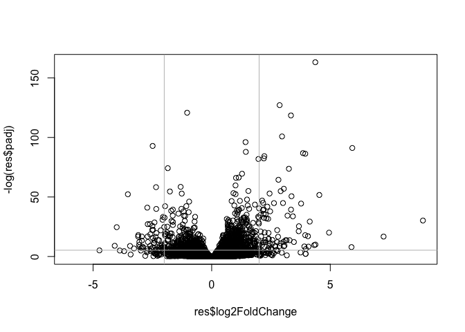
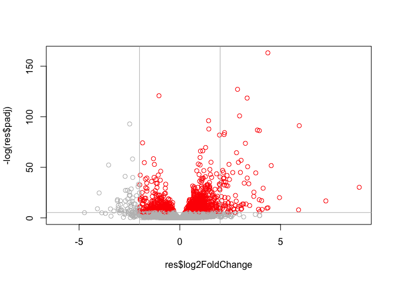

# Class13-Transcriptomics and the analysis of RNA-Seq data
Vanesa Fernandez

``` r
##install.packages("BiocManager")
```

``` r
##For this class, we'll also need DESeq2 
##BiocManager::install("DESeq2")

## Note: say no to prompts to install from source or update
```

``` r
##library(DESeq2)
```

Today we are working with bulk analysis - cool!!!

Use “Bioconductor setup” Lab sheet from the class website.

Where airway smooth muscle cells were treated with dexamethasone, a
synthetic glucocorticoid steroid with anti-inflammatory effects (Himes
et al. 2014).

## Data import

``` r
# Complete the missing code
counts <- read.csv("airway_scaledcounts.csv", row.names=1)
metadata <- read.csv("airway_metadata.csv")
```

Let’s have a wee peak

``` r
head(counts)
```

                    SRR1039508 SRR1039509 SRR1039512 SRR1039513 SRR1039516
    ENSG00000000003        723        486        904        445       1170
    ENSG00000000005          0          0          0          0          0
    ENSG00000000419        467        523        616        371        582
    ENSG00000000457        347        258        364        237        318
    ENSG00000000460         96         81         73         66        118
    ENSG00000000938          0          0          1          0          2
                    SRR1039517 SRR1039520 SRR1039521
    ENSG00000000003       1097        806        604
    ENSG00000000005          0          0          0
    ENSG00000000419        781        417        509
    ENSG00000000457        447        330        324
    ENSG00000000460         94        102         74
    ENSG00000000938          0          0          0

> Q1. How many transcripts/genes in ‘counts’ object?

There are 38694 genes in this dataset

> Q2. How many “control” samples?

``` r
sum(metadata$dex == "control")
```

    [1] 4

``` r
table(metadata$dex)
```


    control treated 
          4       4 

I want to compare “treated” vs. “control”

1.  let’s split the “counts” by `control.counts` vs. `treated.counts`

``` r
##metadata
```

``` r
control.inds <- metadata$dex == "control"
##get the controls and extract its corresponding column 
```

Syntax with df\[rows, cols\]

``` r
control.counts <- counts[,control.inds]
```

Simplifying to one line

``` r
treated.counts <- counts[,metadata$dex == "treated"]
```

Another way

``` r
control.inds
```

    [1]  TRUE FALSE  TRUE FALSE  TRUE FALSE  TRUE FALSE

``` r
!control.inds
```

    [1] FALSE  TRUE FALSE  TRUE FALSE  TRUE FALSE  TRUE

``` r
metadata$dex != "control"
```

    [1] FALSE  TRUE FALSE  TRUE FALSE  TRUE FALSE  TRUE

``` r
metadata$dex != "treated"
```

    [1]  TRUE FALSE  TRUE FALSE  TRUE FALSE  TRUE FALSE

2.  Let’s calculate the mean count per gene for “control” and
    “treated” - then we can compare them. Naming as `control.mean` and
    `treated.mean`

I can use the `apply()` function to apply `mean()` over the rows or
columns of any data.frame. We also want a plot to see levels of
expression between the groups.

``` r
control.mean <- apply(control.counts, 1, mean)
treated.mean <- apply(treated.counts, 1, mean)
```

Put these together for easy book-keeping

``` r
meancounts <- data.frame(control.mean, treated.mean)
##head(meancounts) to visulize data
plot(meancounts) 
```


we cannot make interpretatios out of this plot. Thus, we need to
transform the data to log transformation.

``` r
meancounts <- data.frame(control.mean, treated.mean)
plot(meancounts, log= "xy") 
```


We most often use log2 transforms here because it makes the math easier
for my brain :). Log2 of 0 means no chance of an event happening.
examples:

``` r
log2(20/10)
```

    [1] 1

``` r
log2(10/10)
```

    [1] 0

Log2 = 2, this a rule of tumb to start looking at the data at bigger
scale. Let’s say, we want to see the forest first than the trees. Also,
remember that smaller logs would be for subtle changes in gene
expression and we won’t be really seeing changes, no it’s not practical
to check for changes at larger gene expression amount of data.

``` r
log2(40/10) ## here we can appreciate that a result of 2 means 4x (40) of the referred data (10). A log result of 1 would mean 2x increase related to the referred data (i.e control, it'd be like treated/control)
```

    [1] 2

Let’s calculate the log2 fold change and add it to our wee table
`meancounts`

``` r
meancounts$log2fc <- log2(meancounts$treated.mean/
                        meancounts$control.mean)

head(meancounts)
```

                    control.mean treated.mean      log2fc
    ENSG00000000003       900.75       658.00 -0.45303916
    ENSG00000000005         0.00         0.00         NaN
    ENSG00000000419       520.50       546.00  0.06900279
    ENSG00000000457       339.75       316.50 -0.10226805
    ENSG00000000460        97.25        78.75 -0.30441833
    ENSG00000000938         0.75         0.00        -Inf

In the log2fc column from the results above, we can observe the
magnitude of the changes, i.e 0.6, it’s slightly up, but -2 would be
twice the change down.

Here we’re pulling out the 2 columns and asking to tell us where are “0”
values

With this Boolean result now, we can do math.

``` r
to.rm <- rowSums(meancounts[,1:2] == 0) > 0

mycounts <- meancounts[to.rm,]
```

Filter out all genes

``` r
to.rm <- rowSums(meancounts[,1:2] == 0) > 0
mycounts <- meancounts[!to.rm,] ## to flip it
```

``` r
nrow(mycounts)
```

    [1] 21817

> Q. How many “down” genes do we have at the common log2 fold change
> value of -2…

``` r
##down.ind <- mycounts$log2fc < (-2)
##head(down.ind)
sum(mycounts$log2fc < -2)
```

    [1] 367

> Q. How many “up” at log2FC \> +2

``` r
sum(mycounts$log2fc < 2)
```

    [1] 21503

Do we trust these results? Is there anything missing? A:We’re missing
the stats - P-value

## DESeq analysis

``` r
##message: false
library(DESeq2)
```

DESeq, like many BioConductor packages, wants our input data in a very
specific format.

``` r
dds <- DESeqDataSetFromMatrix(countData = counts, 
                       colData = metadata, 
                        design = ~dex)
```

The main function of DESeq is called `DESeq`

``` r
dds <- DESeq(dds)
```

``` r
res  <- results(dds)
```

``` r
head(res)
```

    log2 fold change (MLE): dex treated vs control 
    Wald test p-value: dex treated vs control 
    DataFrame with 6 rows and 6 columns
                      baseMean log2FoldChange     lfcSE      stat    pvalue
                     <numeric>      <numeric> <numeric> <numeric> <numeric>
    ENSG00000000003 747.194195     -0.3507030  0.168246 -2.084470 0.0371175
    ENSG00000000005   0.000000             NA        NA        NA        NA
    ENSG00000000419 520.134160      0.2061078  0.101059  2.039475 0.0414026
    ENSG00000000457 322.664844      0.0245269  0.145145  0.168982 0.8658106
    ENSG00000000460  87.682625     -0.1471420  0.257007 -0.572521 0.5669691
    ENSG00000000938   0.319167     -1.7322890  3.493601 -0.495846 0.6200029
                         padj
                    <numeric>
    ENSG00000000003  0.163035
    ENSG00000000005        NA
    ENSG00000000419  0.176032
    ENSG00000000457  0.961694
    ENSG00000000460  0.815849
    ENSG00000000938        NA

Next figure is the volcano plot logFoldChange in the x axis and Pvalue
in y axis - logFC vs P-value. We would look at the gene expressed
farther away to the top

``` r
plot(res$log2FoldChange, -log(res$padj)) ## We nee to transform the data with "log"
abline(v=c (-2,2), col="gray") ## v= vertical line
abline (h=-log(0.005), col="gray") ## for alpha level 
```



``` r
log(0.005)
```

    [1] -5.298317

``` r
log(0.000000005) ## this is what we would look for, greatest changes
```

    [1] -19.11383

``` r
mycols <- rep("gray", nrow(res))
mycols [res$log2FoldChange > 2] <- "red"
mycols [res$log2FoldChange > -2] <- "red"
mycols [res$padj > 0.005] <- "gray" ## how many above this 

plot(res$log2FoldChange, -log(res$padj), col=mycols) 
abline(v=c (-2,2), col="gray")
abline (h=-log(0.005), col="gray")
```



``` r
write.csv(res, file = "myresults.csv")
```

## Gene annotation

``` r
head(res)
```

    log2 fold change (MLE): dex treated vs control 
    Wald test p-value: dex treated vs control 
    DataFrame with 6 rows and 6 columns
                      baseMean log2FoldChange     lfcSE      stat    pvalue
                     <numeric>      <numeric> <numeric> <numeric> <numeric>
    ENSG00000000003 747.194195     -0.3507030  0.168246 -2.084470 0.0371175
    ENSG00000000005   0.000000             NA        NA        NA        NA
    ENSG00000000419 520.134160      0.2061078  0.101059  2.039475 0.0414026
    ENSG00000000457 322.664844      0.0245269  0.145145  0.168982 0.8658106
    ENSG00000000460  87.682625     -0.1471420  0.257007 -0.572521 0.5669691
    ENSG00000000938   0.319167     -1.7322890  3.493601 -0.495846 0.6200029
                         padj
                    <numeric>
    ENSG00000000003  0.163035
    ENSG00000000005        NA
    ENSG00000000419  0.176032
    ENSG00000000457  0.961694
    ENSG00000000460  0.815849
    ENSG00000000938        NA

``` r
library("AnnotationDbi") ## bioconductor package
library("org.Hs.eg.db") ## human

##to install:
##BiocManager::install("AnnotationDbi") and BiocManager::install("org.Hs.eg.db")
```

``` r
columns(org.Hs.eg.db)
```

     [1] "ACCNUM"       "ALIAS"        "ENSEMBL"      "ENSEMBLPROT"  "ENSEMBLTRANS"
     [6] "ENTREZID"     "ENZYME"       "EVIDENCE"     "EVIDENCEALL"  "GENENAME"    
    [11] "GENETYPE"     "GO"           "GOALL"        "IPI"          "MAP"         
    [16] "OMIM"         "ONTOLOGY"     "ONTOLOGYALL"  "PATH"         "PFAM"        
    [21] "PMID"         "PROSITE"      "REFSEQ"       "SYMBOL"       "UCSCKG"      
    [26] "UNIPROT"     

``` r
res$symbol <- mapIds(org.Hs.eg.db,
                     keys=row.names(res), # Our genenames
                     keytype="ENSEMBL",        # The format of our genenames
                     column="SYMBOL",          # The new format we want to add
                     multiVals="first")

## remeber, $ here is to make a new column
```

``` r
head(res)
```

    log2 fold change (MLE): dex treated vs control 
    Wald test p-value: dex treated vs control 
    DataFrame with 6 rows and 7 columns
                      baseMean log2FoldChange     lfcSE      stat    pvalue
                     <numeric>      <numeric> <numeric> <numeric> <numeric>
    ENSG00000000003 747.194195     -0.3507030  0.168246 -2.084470 0.0371175
    ENSG00000000005   0.000000             NA        NA        NA        NA
    ENSG00000000419 520.134160      0.2061078  0.101059  2.039475 0.0414026
    ENSG00000000457 322.664844      0.0245269  0.145145  0.168982 0.8658106
    ENSG00000000460  87.682625     -0.1471420  0.257007 -0.572521 0.5669691
    ENSG00000000938   0.319167     -1.7322890  3.493601 -0.495846 0.6200029
                         padj      symbol
                    <numeric> <character>
    ENSG00000000003  0.163035      TSPAN6
    ENSG00000000005        NA        TNMD
    ENSG00000000419  0.176032        DPM1
    ENSG00000000457  0.961694       SCYL3
    ENSG00000000460  0.815849       FIRRM
    ENSG00000000938        NA         FGR

## Path analysis

``` r
##BiocManager::install( c("pathview", "gage", "gageData") )
```

A quick KEGG pathway analysis in the gage

``` r
library(pathview)
library(gage)
library(gageData)
data(kegg.sets.hs)

# Examine the first 2 pathways in this kegg set for humans
head(kegg.sets.hs, 2)
```

    $`hsa00232 Caffeine metabolism`
    [1] "10"   "1544" "1548" "1549" "1553" "7498" "9"   

    $`hsa00983 Drug metabolism - other enzymes`
     [1] "10"     "1066"   "10720"  "10941"  "151531" "1548"   "1549"   "1551"  
     [9] "1553"   "1576"   "1577"   "1806"   "1807"   "1890"   "221223" "2990"  
    [17] "3251"   "3614"   "3615"   "3704"   "51733"  "54490"  "54575"  "54576" 
    [25] "54577"  "54578"  "54579"  "54600"  "54657"  "54658"  "54659"  "54963" 
    [33] "574537" "64816"  "7083"   "7084"   "7172"   "7363"   "7364"   "7365"  
    [41] "7366"   "7367"   "7371"   "7372"   "7378"   "7498"   "79799"  "83549" 
    [49] "8824"   "8833"   "9"      "978"   

I need to speak ENTREZID so I can check KEGG pathway overlap as KEGG
uses ENTREZ format IDs

``` r
res$entrez <- mapIds(org.Hs.eg.db,
                     keys=row.names(res), 
                     keytype="ENSEMBL",       
                     column="ENTREZID",         
                     multiVals="first")
```

I. can now use the **gage** fucntion to check for overlap with known
KEGG pathways

``` r
foldchanges <- res$log2FoldChange
names(foldchanges) <- res$entrez
head(foldchanges)
```

           7105       64102        8813       57147       55732        2268 
    -0.35070302          NA  0.20610777  0.02452695 -0.14714205 -1.73228897 

``` r
# Get the results
keggres = gage(foldchanges, gsets=kegg.sets.hs)
```

``` r
attributes(keggres)
```

    $names
    [1] "greater" "less"    "stats"  

``` r
head(keggres$less, 3)
```

                                          p.geomean stat.mean        p.val
    hsa05332 Graft-versus-host disease 0.0004250461 -3.473346 0.0004250461
    hsa04940 Type I diabetes mellitus  0.0017820293 -3.002352 0.0017820293
    hsa05310 Asthma                    0.0020045888 -3.009050 0.0020045888
                                            q.val set.size         exp1
    hsa05332 Graft-versus-host disease 0.09053483       40 0.0004250461
    hsa04940 Type I diabetes mellitus  0.14232581       42 0.0017820293
    hsa05310 Asthma                    0.14232581       29 0.0020045888

Passing hsa05310

``` r
pathview(gene.data=foldchanges, pathway.id="hsa05310")
```


