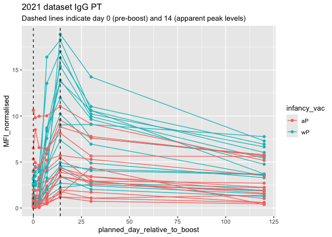

# Class15 Pertussis and the CMI-PB project
Vanesa Fernandez

*key words:* web scrapping, cmi, json, dplyr, inner_join(), filter(),
facet_wrap(),

Pertussis a.k.a Whooping cough, is a highly contagious lung infection
caused by *B. Pertussis*

CDC tracks Pertussis \# cases and can be accessed
[here](https://www.cdc.gov/pertussis/php/surveillance/pertussis-cases-by-year.html?CDC_AAref_Val=https://www.cdc.gov/pertussis/surv-reporting/cases-by-year.html)

**Remember:** to generate the direct link in the word “here”, you can
use [text](website)

Now, how do we scrape the data, if there’s not downloadable version of
it? One way to do this is by using **“datapasta”** package.

> Q1. With the help of the R “addin” package datapasta assign the CDC
> pertussis case number data to a data frame called cdc and use ggplot
> to make a plot of cases numbers over time.

``` r
##install.packages("datapasta")
```

Datapasta will add some Addins that serve to specify which type of data
we are scrapping.

``` r
## copy the table data from the website. Go to Addins and hit Paste as data.frame
cdc <- data.frame(
  year = c(
    1922L, 1923L, 1924L, 1925L,
    1926L, 1927L, 1928L, 1929L, 1930L, 1931L,
    1932L, 1933L, 1934L, 1935L, 1936L,
    1937L, 1938L, 1939L, 1940L, 1941L, 1942L,
    1943L, 1944L, 1945L, 1946L, 1947L,
    1948L, 1949L, 1950L, 1951L, 1952L,
    1953L, 1954L, 1955L, 1956L, 1957L, 1958L,
    1959L, 1960L, 1961L, 1962L, 1963L,
    1964L, 1965L, 1966L, 1967L, 1968L, 1969L,
    1970L, 1971L, 1972L, 1973L, 1974L,
    1975L, 1976L, 1977L, 1978L, 1979L, 1980L,
    1981L, 1982L, 1983L, 1984L, 1985L,
    1986L, 1987L, 1988L, 1989L, 1990L,
    1991L, 1992L, 1993L, 1994L, 1995L, 1996L,
    1997L, 1998L, 1999L, 2000L, 2001L,
    2002L, 2003L, 2004L, 2005L, 2006L, 2007L,
    2008L, 2009L, 2010L, 2011L, 2012L,
    2013L, 2014L, 2015L, 2016L, 2017L, 2018L,
    2019L, 2020L, 2021L, 2022L, 2024L
  ),
  cases = c(
    107473, 164191, 165418, 152003,
    202210, 181411, 161799, 197371,
    166914, 172559, 215343, 179135, 265269,
    180518, 147237, 214652, 227319, 103188,
    183866, 222202, 191383, 191890, 109873,
    133792, 109860, 156517, 74715, 69479,
    120718, 68687, 45030, 37129, 60886,
    62786, 31732, 28295, 32148, 40005,
    14809, 11468, 17749, 17135, 13005, 6799,
    7717, 9718, 4810, 3285, 4249, 3036,
    3287, 1759, 2402, 1738, 1010, 2177, 2063,
    1623, 1730, 1248, 1895, 2463, 2276,
    3589, 4195, 2823, 3450, 4157, 4570,
    2719, 4083, 6586, 4617, 5137, 7796, 6564,
    7405, 7298, 7867, 7580, 9771, 11647,
    25827, 25616, 15632, 10454, 13278,
    16858, 27550, 18719, 48277, 28639, 32971,
    20762, 17972, 18975, 15609, 18617,
    6124, 2116, 3044, 23544
  )
)

##install.packages("styler"), then apply "style selection"
```

Let’s plot year vs. cases to see the trend over time in the US

``` r
library(ggplot2)
```

``` r
baseplot <- 
  ggplot(cdc) +
  aes(year, cases) +
  geom_point() +
  geom_line()


baseplot
```


Let’s add the date

``` r
baseplot +
  theme_bw() + 
  geom_vline(xintercept = 1946, col = "blue")
```


> Q2. Using the ggplot geom_vline() function add lines to your previous
> plot for the 1946 introduction of the wP vaccine and the 1996 switch
> to aP vaccine (see example in the hint below). What do you notice?

Let’s add the date wP vaccine

``` r
baseplot +
  theme_bw() + 
  geom_vline(xintercept = 1946, col = "blue") +
  geom_vline(xintercept = 1996, col = "red") +
  geom_vline(xintercept = 2020, col = "gray") +
  geom_vline(xintercept = 2004)
```


After discussing, we’re seeing that the 2nd vax (AP) had a pattern of
outbreaks after ~4yrs. So CDC realized this and now the recommendation
is every 10yrs for the DTAP vax.

Exploring CMI-PB data. \> Q. Why is this vaccine-preventable disease on
the upswing?

## To answer this question we need to investigate the mechanisms underlying waning protection against pertussis. This requires evaluation of pertussis-specific immune responses over time in wP and aP vaccinated individuals.

\##CMI-PB (Computational Models of Immunity - Pertussis Boost) [cmi
website](https://www.cmi-pb.org/) Very valuable to build predictable
models. Data is available to the public. Helps to be a live predictive
system.

We can monitor subjects given the 1st or 2nd vax, and their immune
system response/gene expression after a period of time (i.e. pre vs post
vaccination data)

You can find this really cool project
[here](https://www.cmi-pb.org/blog/understand-data/)

Go to [Access the data](https://www.cmi-pb.org/data). We’re going to
pull out this API data, which looks overwhelming - [take a look
here](https://www.cmi-pb.org/api/v5/subject). But it’s simple a format
that has an “key item”, followed by a “value”.

Now to make sense of this API data, we’ll use Json to return the values
in a analyzable way and make sense of it. (key:value pairs)

We can use **jsonlite** package and it’s `read_jason()` function

``` r
##install.packages("jsonlite")
```

``` r
library(jsonlite)

subject <- read_json("https://www.cmi-pb.org/api/v5/subject", 
              simplifyVector = TRUE)
```

Let’s have a weep peak

``` r
##head(subject)
```

> Q. How many subjects do we have?

``` r
nrow(subject)
```

    [1] 172

> Q. How many male/female?

``` r
table(subject$biological_sex)
```


    Female   Male 
       112     60 

> Q. How many wP and aP?

``` r
table(subject$infancy_vac)
```


    aP wP 
    87 85 

> Q. break down of biological sex and race

``` r
table(subject$race, subject$biological_sex)
```

                                               
                                                Female Male
      American Indian/Alaska Native                  0    1
      Asian                                         32   12
      Black or African American                      2    3
      More Than One Race                            15    4
      Native Hawaiian or Other Pacific Islander      1    1
      Unknown or Not Reported                       14    7
      White                                         48   32

> Q. Does this break down reflect the US population?

``` r
table(subject$dataset)
```


    2020_dataset 2021_dataset 2022_dataset 2023_dataset 
              60           36           22           54 

``` r
## specimen data
specimen <- read_json("http://cmi-pb.org/api/v5/specimen", 
              simplifyVector = TRUE)

##  plasma_ab_titer
ab_titer <- read_json("http://cmi-pb.org/api/v5/plasma_ab_titer", 
              simplifyVector = TRUE)
```

``` r
##head(specimen)
```

``` r
##head(ab_titer)
```

Now, how do we joint different data points from different tables, i.e.,
subject, specimen, ab_titer tables?

We merge or “join” them to have all the info we need about a given
antibody measurement.We are creating a Meta data to compile based on
subject id.

``` r
library (dplyr)

meta <- inner_join(subject, specimen)
```

``` r
head(meta) ## we can appreciate that the tables are joint by "subject_id". When calling "inner_join" we get a "Joining by" message but it is hidden in this script. 
```

      subject_id infancy_vac biological_sex              ethnicity  race
    1          1          wP         Female Not Hispanic or Latino White
    2          1          wP         Female Not Hispanic or Latino White
    3          1          wP         Female Not Hispanic or Latino White
    4          1          wP         Female Not Hispanic or Latino White
    5          1          wP         Female Not Hispanic or Latino White
    6          1          wP         Female Not Hispanic or Latino White
      year_of_birth date_of_boost      dataset specimen_id
    1    1986-01-01    2016-09-12 2020_dataset           1
    2    1986-01-01    2016-09-12 2020_dataset           2
    3    1986-01-01    2016-09-12 2020_dataset           3
    4    1986-01-01    2016-09-12 2020_dataset           4
    5    1986-01-01    2016-09-12 2020_dataset           5
    6    1986-01-01    2016-09-12 2020_dataset           6
      actual_day_relative_to_boost planned_day_relative_to_boost specimen_type
    1                           -3                             0         Blood
    2                            1                             1         Blood
    3                            3                             3         Blood
    4                            7                             7         Blood
    5                           11                            14         Blood
    6                           32                            30         Blood
      visit
    1     1
    2     2
    3     3
    4     4
    5     5
    6     6

and one last join of `ab_titer` and `meta`

``` r
abdata <- inner_join(meta, ab_titer) 
```

``` r
head(abdata)
```

      subject_id infancy_vac biological_sex              ethnicity  race
    1          1          wP         Female Not Hispanic or Latino White
    2          1          wP         Female Not Hispanic or Latino White
    3          1          wP         Female Not Hispanic or Latino White
    4          1          wP         Female Not Hispanic or Latino White
    5          1          wP         Female Not Hispanic or Latino White
    6          1          wP         Female Not Hispanic or Latino White
      year_of_birth date_of_boost      dataset specimen_id
    1    1986-01-01    2016-09-12 2020_dataset           1
    2    1986-01-01    2016-09-12 2020_dataset           1
    3    1986-01-01    2016-09-12 2020_dataset           1
    4    1986-01-01    2016-09-12 2020_dataset           1
    5    1986-01-01    2016-09-12 2020_dataset           1
    6    1986-01-01    2016-09-12 2020_dataset           1
      actual_day_relative_to_boost planned_day_relative_to_boost specimen_type
    1                           -3                             0         Blood
    2                           -3                             0         Blood
    3                           -3                             0         Blood
    4                           -3                             0         Blood
    5                           -3                             0         Blood
    6                           -3                             0         Blood
      visit isotype is_antigen_specific antigen        MFI MFI_normalised  unit
    1     1     IgE               FALSE   Total 1110.21154       2.493425 UG/ML
    2     1     IgE               FALSE   Total 2708.91616       2.493425 IU/ML
    3     1     IgG                TRUE      PT   68.56614       3.736992 IU/ML
    4     1     IgG                TRUE     PRN  332.12718       2.602350 IU/ML
    5     1     IgG                TRUE     FHA 1887.12263      34.050956 IU/ML
    6     1     IgE                TRUE     ACT    0.10000       1.000000 IU/ML
      lower_limit_of_detection
    1                 2.096133
    2                29.170000
    3                 0.530000
    4                 6.205949
    5                 4.679535
    6                 2.816431

``` r
nrow(abdata)
```

    [1] 52576

``` r
table(abdata$isotype)
```


      IgE   IgG  IgG1  IgG2  IgG3  IgG4 
     6698  5389 10117 10124 10124 10124 

``` r
table(abdata$antigen)
```


        ACT   BETV1      DT   FELD1     FHA  FIM2/3   LOLP1     LOS Measles     OVA 
       1970    1970    4978    1970    5372    4978    1970    1970    1970    4978 
        PD1     PRN      PT     PTM   Total      TT 
       1970    5372    5372    1970     788    4978 

Let’s begin w IgG Filter with `dplyr`

``` r
igg <- filter(abdata, isotype == "IgG")

head(igg)
```

      subject_id infancy_vac biological_sex              ethnicity  race
    1          1          wP         Female Not Hispanic or Latino White
    2          1          wP         Female Not Hispanic or Latino White
    3          1          wP         Female Not Hispanic or Latino White
    4          1          wP         Female Not Hispanic or Latino White
    5          1          wP         Female Not Hispanic or Latino White
    6          1          wP         Female Not Hispanic or Latino White
      year_of_birth date_of_boost      dataset specimen_id
    1    1986-01-01    2016-09-12 2020_dataset           1
    2    1986-01-01    2016-09-12 2020_dataset           1
    3    1986-01-01    2016-09-12 2020_dataset           1
    4    1986-01-01    2016-09-12 2020_dataset           2
    5    1986-01-01    2016-09-12 2020_dataset           2
    6    1986-01-01    2016-09-12 2020_dataset           2
      actual_day_relative_to_boost planned_day_relative_to_boost specimen_type
    1                           -3                             0         Blood
    2                           -3                             0         Blood
    3                           -3                             0         Blood
    4                            1                             1         Blood
    5                            1                             1         Blood
    6                            1                             1         Blood
      visit isotype is_antigen_specific antigen        MFI MFI_normalised  unit
    1     1     IgG                TRUE      PT   68.56614       3.736992 IU/ML
    2     1     IgG                TRUE     PRN  332.12718       2.602350 IU/ML
    3     1     IgG                TRUE     FHA 1887.12263      34.050956 IU/ML
    4     2     IgG                TRUE      PT   41.38442       2.255534 IU/ML
    5     2     IgG                TRUE     PRN  174.89761       1.370393 IU/ML
    6     2     IgG                TRUE     FHA  246.00957       4.438960 IU/ML
      lower_limit_of_detection
    1                 0.530000
    2                 6.205949
    3                 4.679535
    4                 0.530000
    5                 6.205949
    6                 4.679535

Let’s make a box plot of Ig levels – A plot of MFI vs antigen

``` r
ggplot(igg) +
  aes(MFI, antigen) +
  geom_boxplot()
```


To make a plot by infancy vac differentiating the two vaxs by color

``` r
ggplot(igg) +
  aes(MFI_normalised, antigen, col=infancy_vac) + ## remember "col" is for coloring
  geom_boxplot()
```


Ideally, I would like to see how these Ab levels change over time
relative to the booster shot.

``` r
table(abdata$visit) ## How many visits?
```


       1    2    3    4    5    6    7    8    9   10   11   12 
    8280 8280 8420 6565 6565 6210 5810  815  735  686  105  105 

Faceting the data by infancy vac

``` r
ggplot(igg) +
  aes(MFI_normalised, antigen, col=infancy_vac) +
  geom_boxplot() +
  facet_wrap(~infancy_vac)
```


Faceting the data by visit and differentiated by infancy vax type

``` r
ggplot(igg) +
  aes(MFI_normalised, antigen, col=infancy_vac) +
  geom_boxplot() +
  facet_wrap(~visit)
```


Make a line plot of 2021 data using dataset IgG PT. Where each line of
teh plot is a subject

``` r
abdata.21 <- abdata %>% filter(dataset == "2021_dataset")

abdata.21 %>% 
  filter(isotype == "IgG",  antigen == "PT") %>%
  ggplot() +
    aes(x=planned_day_relative_to_boost,
        y=MFI_normalised,
        col=infancy_vac,
        group=subject_id) +
    geom_point() +
    geom_line() +
    geom_vline(xintercept=0, linetype="dashed") +
    geom_vline(xintercept=14, linetype="dashed") +
  labs(title="2021 dataset IgG PT",
       subtitle = "Dashed lines indicate day 0 (pre-boost) and 14 (apparent peak levels)")
```



``` r
abdata.23 <- abdata %>% filter(dataset == "2023_dataset")

abdata.23 %>% 
  filter(isotype == "IgG",  antigen == "PT") %>%
  ggplot() +
    aes(x=planned_day_relative_to_boost,
        y=MFI_normalised,
        col=infancy_vac,
        group=subject_id) +
    geom_point() +
    geom_line() +
    geom_vline(xintercept=0, linetype="dashed") +
    geom_vline(xintercept=14, linetype="dashed") +
  labs(title="2023 dataset IgG PT",
       subtitle = "Dashed lines indicate day 0 (pre-boost) and 14 (apparent peak levels)")
```


Obtaining CMI-PB RNASeq data, see
[here](https://bioboot.github.io/cmi-pb_teaching/introduction/intro_to_cmi-pb.html#exploring-cmi-pb-data)
